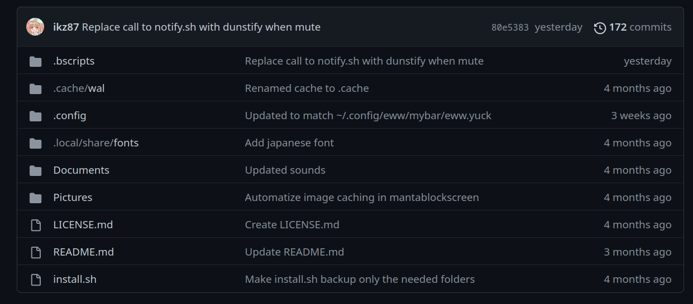

# 这是一个对《dots-2.0》配置的整体解析
- 原配置仓库地址：[ikz87/dots-2.0: eww + bspwm rice c:](https://github.com/ikz87/dots-2.0)\
  **非常感谢 ikz87 同学的rice。**

  本文基于以下基础条件讲解：
  ```
  OS:       Arch Linux

  WM:       bspwm
  ```

  这篇文章将会从每个文件的作用和配置方式以及使用方法来尽可能的带大家入门到掌握这份配置文件。

## 配置的目录结构

### `.bscripts`
  1. `.bscripts` 目录中存放了这份配置扩展的各个功能的脚本调用实现
      
      简单来说，这个目录存放的脚本是用来实现某些功能的。

  - `brightness.sh`\
    `brightness.sh` 是一个用于控制屏幕亮度的脚本。
- `.cache`
- `.config`
- `.local`
- `Documents`
- `Pictures`
- `install.sh`


